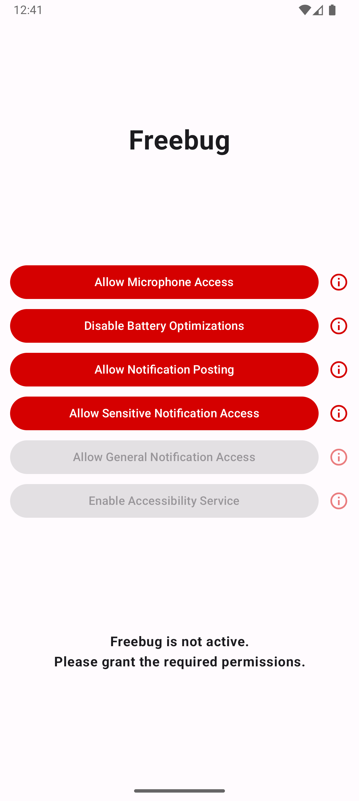
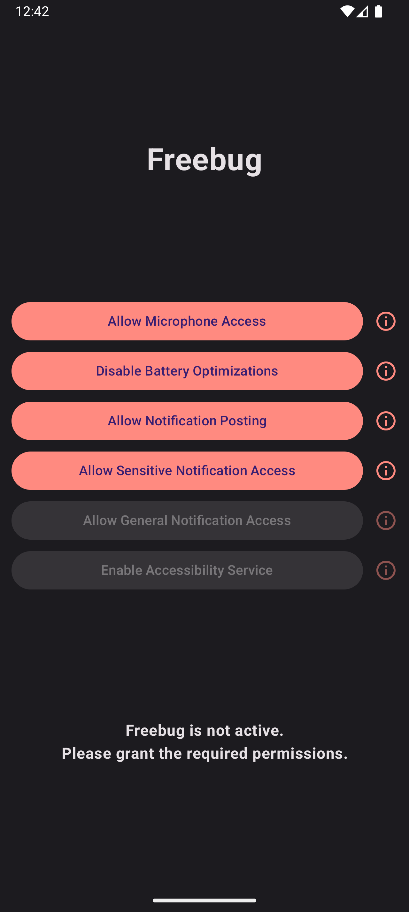
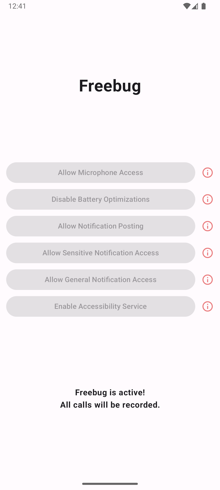
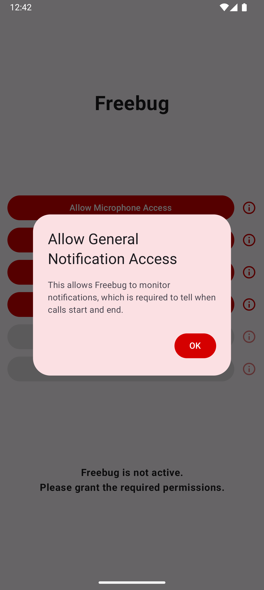

# &nbsp; Freebug

A simple and modern call recorder app for Android.

## About

- Freebug records all incoming and outgoing across a wide range of apps.
- The app has been tested with the system dialer (Phone app) and WhatsApp on stock Android and GrapheneOS.
  - For other apps and OSes, your mileage may vary.
  - There is no definitive list of supported apps since Freebug takes an app-agnostic heuristics-based approach.
- Note that due to Android restrictions, caller audio is very muffled (but still fairly audible in quiet environments). This is not a problem when the call is on speakerphone.
- There are currently no customization options to limit recording to specific apps or contacts, or to customize the call detection logic. This may change in the future. 

## Screenshots

|  |            |     |
| ------------------------------------------------------ | ----------------------------------------------------------------------- | -------------------------------------------------------------------- |
|    |  |  |

## How it Works

1. A [NotificationListenerService](https://developer.android.com/reference/android/service/notification/NotificationListenerService) watches all notifications come and go.
2. Each notification is categorized as a "call" or "not call" notification depending on some simple heuristics.
   - We exploit the fact that most call apps show a notification throughout the duration of the call, to tell if a call is ongoing.
   - This lets us take an app-agnostic approach (instead of having to write custom code for WhatsApp, Signal, Google Dialer, etc.) — if it looks like a call, we record it (obviously this could lead to false positives, the rates of which should go down as the filtering logic is improved over time).
   - To do this properly, we must be able to read all the notification content, even for notifications that Android categorizes as "sensitive" (including call notifications). For this reason, we must have the `RECEIVE_SENSITIVE_NOTIFICATIONS` permission, which can only be granted via [ADB](https://developer.android.com/tools/adb).
3. If an ongoing call is detected, we use an [AccessibilityService](https://developer.android.com/reference/android/accessibilityservice/AccessibilityService) to record it.
   - An AccessibilityService is used because it is the only kind of service that is allowed to start using the microphone when the recording app is not in the foreground.
   - Accessibility services are also much less prone to being killed by battery optimization, so we use it to restart the notification listener if that gets killed off.
   - Battery optimization for the app in general also must be turned off to further improve resilience.
4. When a call ends, the recording is saved to the Android `Recordings` directory, which can be written to without any file access permissions.
